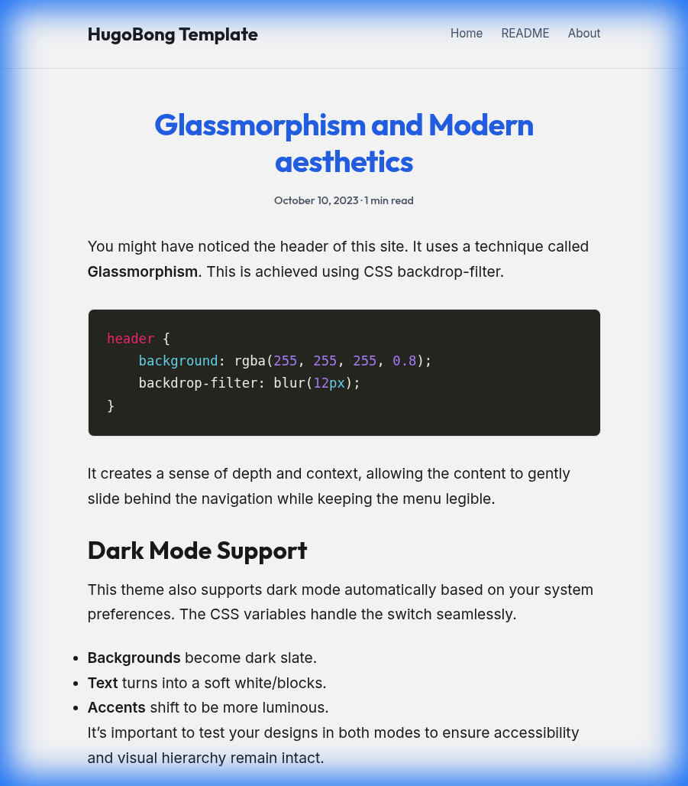

# Monoscroll - Modern Hugo Infinite Scroll Theme

A sleek, minimalist Hugo theme designed for a seamless reading experience with infinite scrolling, modern glassmorphism aesthetics, and clean typography.



## Features

- **Infinite Scrolling**: Automatically loads the next post as the reader reaches the bottom.
- **Glassmorphism Design**: Translucent headers and modern UI elements for a premium feel.
- **Dark Mode Support**: Automatically adapts to user system preferences.
- **Minimalist Aesthetics**: Focused on content with clean spacing and beautiful typography.
- **Fully Responsive**: Looks great on desktops, tablets, and mobile devices.
- **Syntax Highlighting**: Built-in support for code snippets with highlighting.

## Getting Started

### Installation

If you are using this as a standalone project:

1. Clone the repository:
   ```bash
   git clone https://github.com/your-username/hugo-infinite-scroll.git
   cd hugo-infinite-scroll
   ```

2. Run the Hugo server to see it in action:
   ```bash
   hugo server -D
   ```

3. Open your browser to `http://localhost:1313`.

### Configuration

Edit the `hugo.toml` file in the root directory to customize your site:

```toml
title = 'My Infinite Blog'
theme = 'monoscroll'

[params]
  description = "A modern continuous scroll blog template."
  mainSections = ["posts"]
```

### Adding New Posts

Create a new post using the Hugo CLI:

```bash
hugo new posts/my-new-post.md
```

The theme will automatically include it in the infinite scroll sequence.

## Customization

### Styles
You can customize the look and feel by modifying the CSS in the `assets` or `static` directories of the theme.

### Layouts
The infinite scroll logic is primarily handled in `themes/monoscroll/layouts/_default/list.html` and `index.html`.

## License
MIT
